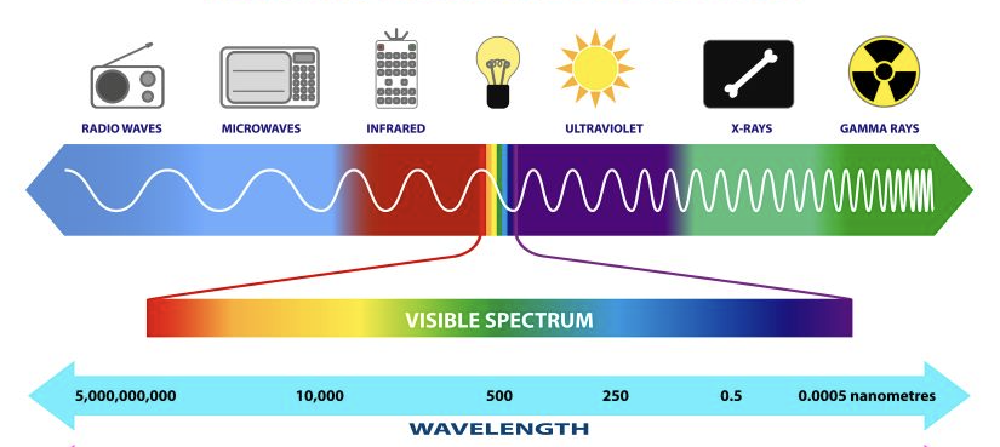
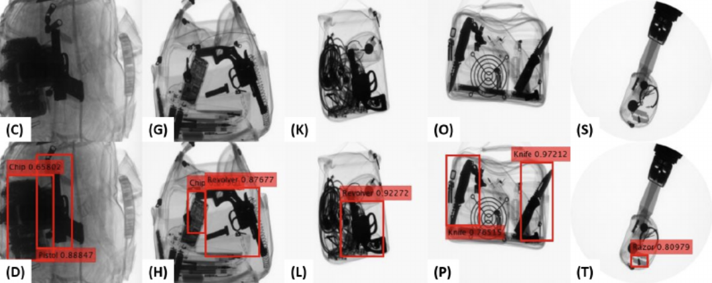
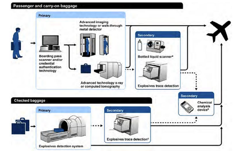
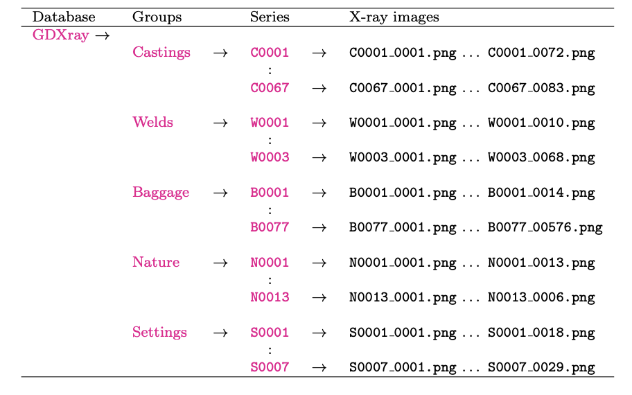

# Thriving Skies:  AI Modeling for X-Ray Baggage Screenings
----
Team Members:  Ryan Busman, Elaine Kwan, Deb Peters, Nick Watkins

  

# Table of Contents

Click on any of the below to take you to the desired subsection or your choice. 

* [**Overview**](#Overview)  
* [**Project Purpose and Goals**](#Project-Purpose-and-Goals) 
* [**Audience**](#Audience) 
* [**About the Data**](#About-the-Data) 
* [**About the Data Analysis**](#About-the-Data-Analysis) 
* [**Github Directory Structure**](#Github-Directory-Structure)

## Overview
----
### Why Aviation Security Matters
In the wake of the COVID-19 pandemic, a surge in air travel has swept the globe, reigniting the skies with bustling activity. By the close of 2023, air traffic had reclaimed its pre-pandemic vigor, soaring to 94.1% of 2019 levels, with promising projections for the year ahead (IATA, 2023, 2024). The International Air Transport Association (IATA) anticipates a groundbreaking year in 2024, with the global airline passenger industry poised to achieve record growth—encompassing 4.7 billion passengers, 964 billion dollars in revenue, and 49.3 dollars billion in operating profit (IATA, 2023, 2024).  

*Figure 1: Passenger load factor (PLF) reflects the utilization of an airline's passenger capacity. As of late 2023, PLF had surged back to nearly pre-pandemic levels across all regions, as revealed by IATA's research.*   

Safeguarding this aviation ecosystem is the mandate of the United States of America's Transportation Security Administration (TSA). Each day, TSA personnel screen approximately 2 million passengers at 440 airports nationwide (TSA, 2022). Every carry-on bag undergoes inspection, totaling 3.3 million screenings daily (TSA, 2024). 

While the scale of TSA operations is undeniably impressive, the agency is not resting on its laurels. Acknowledging the imperatives of efficiency and accuracy, the TSA is pioneering innovative solutions to streamline the security screening process:

> TSA requires detection technologies that effectively and efficiently screen people for concealed explosive threats. Currently, as people move through checkpoints they must remove outerwear, footwear, belts and headwear, slowing the line and decreasing public acceptance. False alarms are frequent, causing inconvenient and intrusive pat-downs and searches. SaS is developing technology that would enable the scanning of walking passengers, acquiring data through most garments and reliably detecting a wider range of prohibited items regardless of concealment. (TSA, 2024, *Screening at Speed*)

False positives not only disrupt the flow of passengers but also pose significant costs and privacy concerns. To mitigate these challenges, precision and swiftness are paramount. Here, the integration of artificial intelligence and machine learning is emerging as a coup, enhancing the accuracy and efficiency of security screening by automatically identifying potential threats (Greenberg & Gehm, 2020).  

  

*Figure 2: Continuously innovating, the TSA envisions a future where security screening seamlessly integrates advanced technologies like 3-D imaging and X-Ray diffraction to bolster threat detection capabilities.*

### The Invisible Made Visible:  How X-Rays Work
X-rays, like visible light are energy or electromagnetic radiation.  However, unlike traditional visible-spectrum imagery, X-rays can pass through objects.  Therefore, images created from X-rays offer transparent views of solid objects and can reveal hidden things.

  

*Figure 3:  While invisible to the naked eye, X-rays are still part of the electromagnetic spectrum, offering unique insights into the hidden worlds inside and around us.*

Key to X-ray imaging is attenuation—the measure of energy absorption and deflection as X-rays traverse materials. Defined by the linear attenuation coefficient (μ), attenuation varies with material density, with denser substances like metals exhibiting higher absorption levels. Consequently, metallic objects cast darker shadows on X-ray image negative, akin to the silhouettes in a shadow puppet show.

  

*Figure 4: Through attenuation, X-ray images reveal the concealed, with dangerous metallic objects emerging as distinct shadows against the backdrop. (Image adapted from Hassan et al., 2020)*

X-ray baggage screening both single-shot and continuous exposure techniques. The latter, prevalent in cabin baggage screening, offers seamless scanning as items glide along conveyor belts, ensuring swift and thorough examination.

###  A Typical Screening Flow in US Airports

  

*Figure 5: A diagram of a typical security screening flow in a US airport.* 

## Project Purpose and Goals
----
Our thriving skies project charts a course toward enhanced screening procedures, with a keen focus on baggage inspection enhanced with automated object detection algorithms, powered by cutting-edge convolutional neural networks.  

At the project's culmination, a dynamic web interface will emerge, empowering security personnel with real-time assessments of X-ray images, expediting threat identification, and ensuring the skies remain safe for all travelers.

* **Goal 1:  Improve Screening Accuracy**

    Improve accuracy of dangerous object detection in carry-on passenger bags.   

* **Goal 2:  An Intuitive Screening Interface**  

    Create a web-based interactive tool that can be used to assess the likelihood of a dangerous object in baggage

## Audience
----
* **Transportation Security Administration (TSA) Officials**: Personnel involved in airport security operations, policy development, and technology implementation within the TSA.

* **Airline Executives and Managers**: Decision-makers within airline companies responsible for ensuring the safety and security of passengers and crew.

* **Airport Authorities**: Officials overseeing airport operations, security protocols, and infrastructure development.

* **Security Equipment Manufacturers**: Companies involved in the design, development, and production of security screening equipment and technologies.

* **Aviation Industry Associations**: Organizations representing various stakeholders in the aviation sector, such as the International Air Transport Association (IATA) and Airports Council International (ACI).

* **Travelers**: Individuals interested in understanding the efforts being made to enhance aviation security and ensure safe air travel experiences.

# About the Data
----
* __Organization__: Pontificia Universidad Catolica de Chile - Department of Computer Science - The GRIMA Machine Intelligence Group
* __Database Name__:  GDXray+ (or the GRIMA X-ray database)  
* __Data Access__:  https://domingomery.ing.puc.cl/material/gdxray/
* __Data Characteristics__: 
    - 21,100 X-ray images organized into 5 groups.  Each group has several series.  
    - Images are saved as Portable Network Graphics (png) 8 -bit grayscale format. 
    - "Additional metadata for each series (such as description of the objects, parameters and description of X-ray imaging system, etc.) are given in an ASCII file called Xssss readme.txt included in sub-folder Xssss, e.g., C0003 readme.txt for series Castings/C0003." (Mery et al., 2015, pg. 4) 

  

 

*Figure 6: The GDXray+ five groups of data with their series. (Image adapted from Mery et al., 2015)*   

* __Data Subset__:  Baggage (3.048GB)

> **Licensure and Credits:**
> -  The X-ray images included in GDXray+ can be used free of charge, for research and educational purposes only. 
> - Redistribution and commercial use is prohibited. Any researcher reporting results which use this database should acknowledge the GDXray+ database by citing:
>   >Mery, D.; Riffo, V.; Zscherpel, U.; Mondragón, G.; Lillo, I.; Zuccar, I.; Lobel, H.; Carrasco, M. (2015): GDXray: The database of X-ray images for nondestructive testing. Journal of Nondestructive Evaluation, 34.4:1-12. [ PDF ]**

# About the Data Analysis
----
## Data Collection
* Gather a large dataset of  X-ray images containing both normal and prohibited items (such as  weapons, explosives, and sharp objects).
* Annotate the images to label  the presence or absence of prohibited items.

## Preprocessing
* Clean and preprocess the X-ray  images to enhance their quality.
* Normalize pixel values and  resize images to a consistent resolution.

 

## Model Selection 
* Choose an appropriate deep  learning model for object detection. 

## Model Architecture 
* Design a custom model or work  with a pre-trained model.
* Add layers for object  detection and classification.

## Data Augmentation 
* Augment the dataset by  applying transformations (rotation, scaling, etc.) to create additional  training samples

## Training 
* Split the dataset into  training, validation, and test sets.
* Train the model using the  annotated X-ray images.
* Optimize hyperparameters  (learning rate, batch size, etc.).

## Evaluation

* Evaluate the model’s  performance on the validation and test sets.
* Metrics could include  precision, recall, F1-score, and accuracy.  Test for bias.  

## Fine-Tuning:

* Fine-tune the model based on  evaluation results.
* Address false positives and  false negatives.

## Model Implementation

## Github Directory Structure
---
* **Code**:  contains all code by topic
* **Data**:  contains all datasets by topic
* **Images**: contains images for the final presentation and README.md
* **Presentation**: contains the final presentation 
* **Sources**:  secondary research literature
* **Proposal**:  the initial proposal for the project
* **README.md**:  contains project details and definitions

